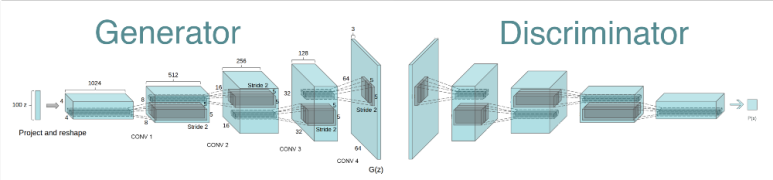
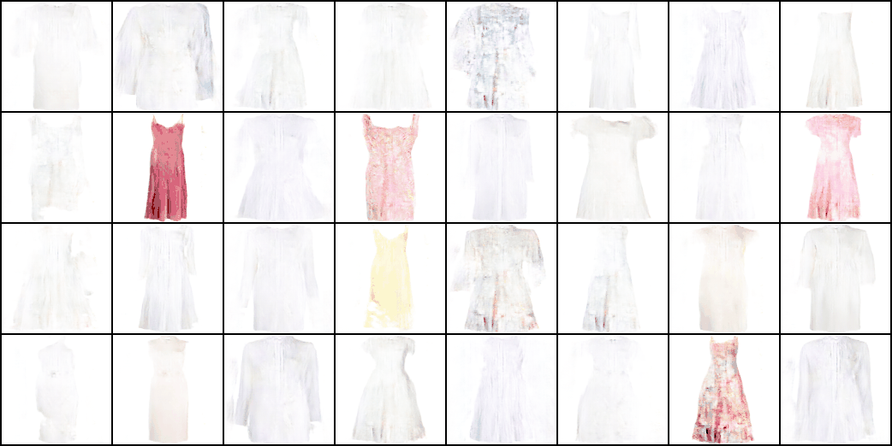

# Dress Designer

## THIS IS PYTORCH VERSION OF [THIS PORJECT](https://github.com/Won-Been/ai06project4).

## 1. DCGAN
- Model architecture([DCGAN](https://arxiv.org/abs/1511.06434))


## 2. Dress data
- Download dress images from Kaggle.

## 3. Hyperparameters
image size : 128 (defualt)     
epochs : 100 (defualt)     
generator learning rate : 0.0004 (defualt)     
discriminator learning rate : 0.00004 (defualt set to 0.0004)     
momentum : 0.5 (defualt)      
batch size : 32 (default)     

## 4. During training


## 5. Generate images
```bash
python main.py --mode "generate" --model_path --generated_img_path 
```

